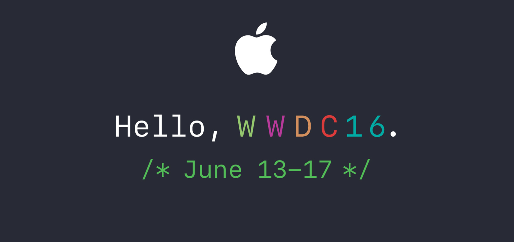
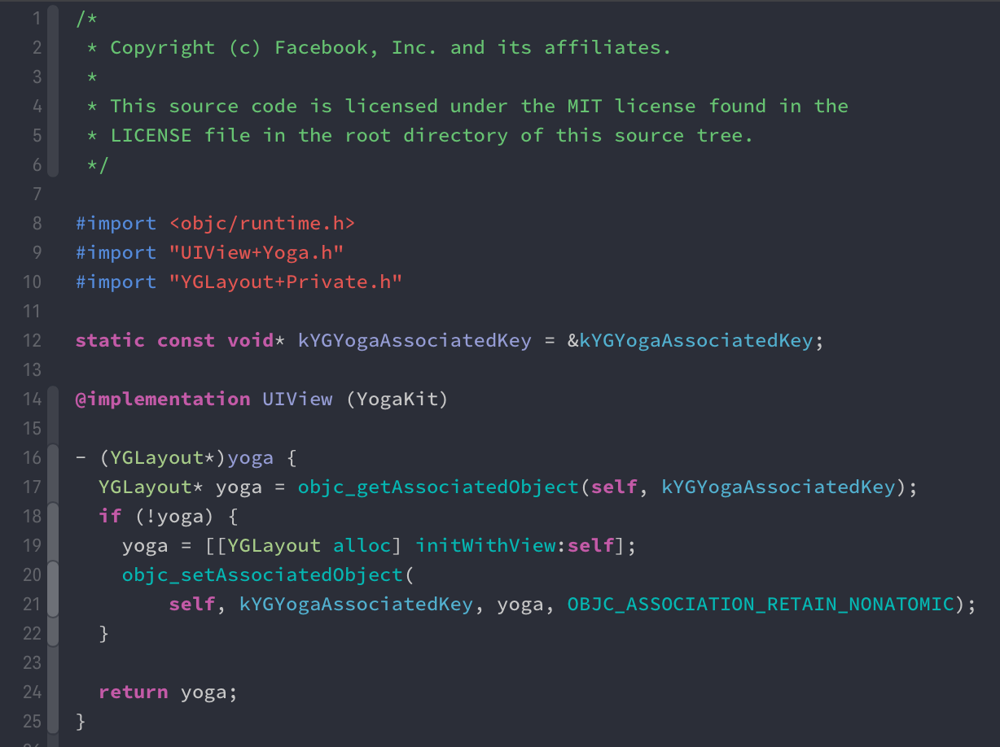
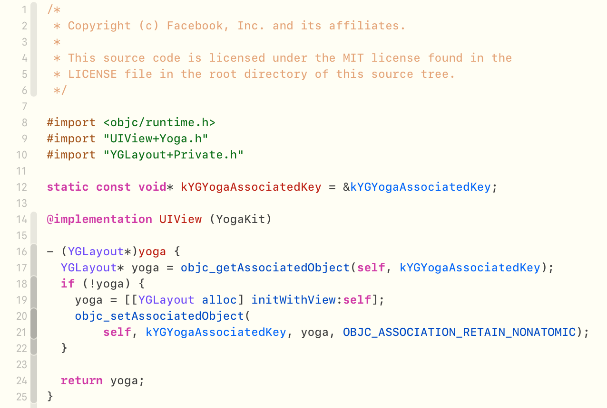

# Xcode Forever16 theme

Colorful dark color scheme for Xcode inspired by Apple's WWDC16.



wwdc16 stylesheet:

```css
.color-orange { color: #d28e5d;}
.color-red { color: #dc3c3c;}
.color-fusia { color: #b73999;}
.color-purple { color: #8485ce;}
.color-forest-green { color: #64878f;}
.color-mint-green { color: #95c76f;}
.color-green { color: #52bd58;}
.color-blue-green { color: #00aba5;}
.color-blue { color: #4670d8;}
.bg-dark { background-color: #20222B; }
```

- Dark theme

    

- Light theme

    

## Install

1. Exit Xcode
1. Run `install.sh`
2. Open Xcode and select  `Forever16` theme.
